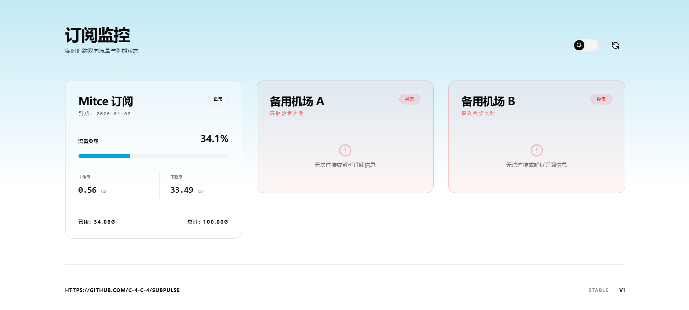

# 訂閱監控看板 (Subscription Monitor • Pure)

## 📌 項目簡介



這是一個基於 Cloudflare Workers 構建的輕量級、無伺服器（Serverless）訂閱流量監控看板。該程式將後端 API 解析與前端頁面渲染集於一身，能夠定時獲取指定代理節點訂閱鏈接（如 V2Ray、Clash 等）的流量資訊，並透過一個具有現代化 UI 設計的頁面進行即時視覺化展示。
版本資訊：**STABLE V1**

## ✨ 核心特性

### 後端 (API 層)

- **併發數據獲取**: 使用 `Promise.all` 異步併發請求多個訂閱鏈接，極大縮短數據獲取時間。
- **嚴格超時控制**: 內置 `fetchWithTimeout` 機制（預設 5 秒），防止因單個異常節點響應過慢而阻塞整個頁面的加載。
- **精準請求模擬**: 請求頭部偽裝為 `v2rayN/6.23`，以確保兼容大部分機場/服務商的訂閱下發策略。
- **智能數據提取**: 自動解析 HTTP 響應頭中的 `Subscription-Userinfo` 字段，提取 `upload`、`download`、`total` 和 `expire` 數據，並自動換算為 GB 單位。
- **內置緩存控制**: 接口級設置 `Cache-Control: public, max-age=60`，靜態 HTML 緩存 `3600` 秒，有效降低源站 API 壓力。

### 前端 (UI 層)

- **現代化純粹設計**: 採用 "Pure" 主題理念，基於 Tailwind CSS 構建高斯模糊卡片（毛玻璃效果）、漸變高亮背景和絲滑的動畫過渡。
- **骨架屏加載**: 數據請求期間提供 Skeleton 骨架屏動畫，拒絕白屏等待，提升用戶體驗。
- **動態狀態反饋**:
  - 根據流量使用比例自動改變進度條和數值的顏色（正常、警告、危險）。
  - 遇到無法連接或解析失敗的節點時，展示專屬的紅色「異常」 UI 樣式。
- **完善的暗黑模式**: 支持自動檢測並跟隨系統主題，同時提供一個帶絲滑動畫的「日月膠囊開關」供手動切換（偏好會自動保存至 `localStorage`）。

## 🛠️ 技術棧

- **運行環境**: Cloudflare Workers
- **前端樣式**: Tailwind CSS (透過 CDN 引入) + 原生 CSS 變量
- **前端邏輯**: Vanilla JavaScript

## ⚙️ 配置指南
在部署之前，你只需要修改代碼最頂部的 `SUBSCRIPTIONS` 數組即可：

```javascript
// 1. 訂閱地址配置區
const SUBSCRIPTIONS = [
  { name: "你的主用機場", url: "https://your-sub-link-1.com/xxx" },
  { name: "備用節點 A", url: "https://your-sub-link-2.com/xxx" },
  { name: "備用節點 B", url: "https://your-sub-link-3.com/xxx" }
];
```

- **name**: 顯示在面板上的自定義名稱。
- **url**: 你的真實訂閱鏈接。

## 📡 API 接口參考
該 Worker 自帶一個隱藏的數據接口，供前端 AJAX 調用。

- **路徑**: `/api/traffic`
- **請求方式**: `GET`
- **響應格式**: JSON 數組
- **數據結構示例**:

```json
[
  {
    "name": "你的主用機場",
    "up_gb": "12.50",
    "dl_gb": "180.20",
    "used_gb": "192.70",
    "total_gb": "500.00",
    "usage_percent": "38.5",
    "expire_date": "2026-12-31"
  },
  {
    "name": "備用節點 A",
    "error": true
  }
]
```

## 🚀 部署說明

1. 登錄 Cloudflare Dashboard。
2. 導航至 **Workers & Pages**，點擊 **Create Worker**。
3. 為你的應用輸入一個名稱，點擊 **Deploy**。
4. 部署完成後，點擊 **Edit code** 進入網頁編輯器。
5. 將本地 `worker.js` 中的所有代碼粘貼並覆蓋編輯器內的預設代碼。
6. 修改代碼第 2-6 行的 `SUBSCRIPTIONS` 配置為你自己的訂閱資訊。
7. 點擊右上角的 **Save and deploy**。
8. 訪問 Cloudflare 分配的 `*.workers.dev` 域名即可查看你的專屬監控看板。
