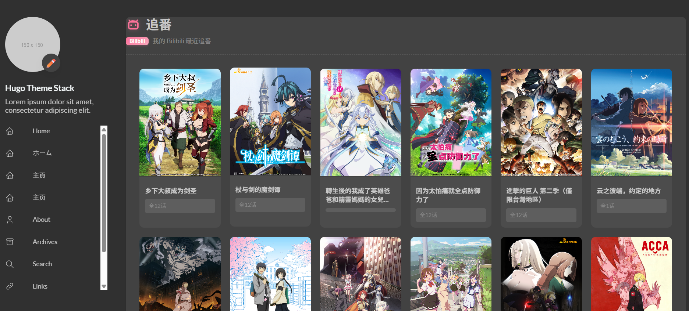

<style>
  /* 限制小尺寸 Logo 作为封面图时被过度放大 */
  .hero-image .cover-image, .hero-image #blurImage {
    max-width: 220px !important;
    margin: 0 auto;
    object-fit: contain;
  }
</style>

## 前言

在個人博客的建設過程中，展示 Bilibili 的「近期追番」記錄是一項常見的擴展需求。

然而，若直接在前端渲染層使用 JavaScript（如 `fetch` API）請求 Bilibili 官方接口，將會受限於瀏覽器的 **CORS（跨域資源共享）** 安全策略，導致請求被攔截並報錯。雖然存在如 `AllOrigins` 或 `CorsProxy` 等第三方跨域代理方案，但此類依賴外部公共代理的做法往往伴隨著較高的網絡延遲與服務穩定性風險，難以滿足頁面加載的可用性要求。

為確保數據獲取的穩定性與展示效果，推薦採用靜態站點生成器 (SSG) 的後端構建能力作為解決方案，即在構建時（或 SSR 渲染階段）直接從服務端拉取第三方數據。

本文將詳細說明如何在 **Astro** 與 **Hugo** 中，實現高可用且無 CORS 限制的 Bilibili 追番頁面集成。

---

## 方案一：基於 Astro 的構建時獲取

Astro 框架原生支持在組件的 Server-side 作用域（即 `---` 之間）執行 Node.js 代碼及 `fetch` 請求。此特性可直接於服務端完成跨域接口的調用，有效規避前端 CORS 限制。

### 核心代碼實現

通過創建自定義 Astro 組件，服務器將在構建階段向 Bilibili API 發起請求，並將返回的 JSON 數據直接編譯為靜態 HTML。此方案避免了客戶端額外的網絡開銷，顯著提升了首屏渲染性能。


```astro
---
// src/components/about/BilibiliBangumi.astro
const uid = "3546871211494149"; // 替換為你的 B 站 UID
const api = `https://api.bilibili.com/x/space/bangumi/follow/list?type=1&follow_status=0&pn=1&ps=15&vmid=${uid}`;

let bangumis = [];
let errorMsg = null;

// 使用 AbortController 設置超時，防止 B 站 API 響應慢拖垮打包或加載速度
const controller = new AbortController();
const timeoutId = setTimeout(() => controller.abort(), 2500);

try {
  const response = await fetch(api, {
    headers: {
      // 必須偽裝 User-Agent，否則可能被 B 站攔截
      'User-Agent': 'Mozilla/5.0 (Windows NT 10.0; Win64; x64) AppleWebKit/537.36'
    },
    signal: controller.signal
  });
  const resData = await response.json();
  if (resData.code === 0 && resData.data && resData.data.list) {
    bangumis = resData.data.list;
  } else {
    errorMsg = `獲取失敗: Code ${resData.code}`;
  }
} catch (e: any) {
  errorMsg = e.name === 'AbortError' ? '請求超時 (Timeout)' : e.message;
} finally {
  clearTimeout(timeoutId);
}
---

<div class="mt-4 my-6 not-prose">
  {errorMsg ? (
    <div class="p-8 border rounded-xl text-center">無法加載追番數據 ({errorMsg})</div>
  ) : bangumis.length > 0 ? (
    <div class="grid grid-cols-2 sm:grid-cols-3 md:grid-cols-4 lg:grid-cols-5 gap-4">
      {bangumis.map((b: any) => (
        <a href={b.url} target="_blank" rel="noopener noreferrer" class="group relative block overflow-hidden rounded-xl bg-muted transition-transform hover:-translate-y-1">
          <div class="aspect-[3/4] overflow-hidden">
            <!-- 核心細節：將 http 替換為 https 防止 Mixed Content 警告 -->
            
          </div>
          <div class="absolute inset-x-0 bottom-0 flex flex-col justify-end bg-gradient-to-t from-black/90 to-transparent p-3 pt-8 opacity-90 transition-opacity group-hover:opacity-100">
            <h3 class="text-xs font-bold text-white line-clamp-2">{b.title}</h3>
            <p class="text-[10px] text-zinc-300">{b.new_ep?.index_show || '未知內容'}</p>
          </div>
        </a>
      ))}
    </div>
  ) : (
    <div class="p-8 border rounded-xl text-center">暫無追番記錄</div>
  )}
</div>
```

**技術實現要点：**
1. **超時控制**：引入 `AbortController` 設置 2.5 秒超時閾值，防止第三方 API 響應異常阻塞構建進程。
2. **資源協議升級**：Bilibili API 返回的封面圖片 URL 默認為 `http://`，組件內通過正則表達式或字符串替換將其強制升級為 `https://`，以消除現代瀏覽器的 Mixed Content 安全警告。

---

## 方案二：基於 Hugo `resources.GetRemote` 實現

對於使用 Hugo 框架構建的項目，其原理與 Astro 類似。Hugo 提供了 `resources.GetRemote` 內置函數，允許在執行 `hugo server` 或構建靜態站點時，由宿主機直接發起後端 HTTP 請求。

### 核心代碼實現

可於 Hugo 頁面模板（如 `layouts/page/bilibili.html`）中集成以下構建邏輯：



```html
{{ $vmid := "3546871211494149" }}
{{ $url := printf "https://api.bilibili.com/x/space/bangumi/follow/list?type=1&follow_status=0&pn=1&ps=15&vmid=%s" $vmid }}
<!-- 偽裝請求頭 -->
{{ $opts := dict "headers" (dict "User-Agent" "Mozilla/5.0 (Windows NT 10.0; Win64; x64)" "Referer" "https://space.bilibili.com/") }}

{{ $biliData := dict }}
{{ $err := false }}

<!-- 使用最新 Hugo 支援的 try 函數抓取 JSON -->
{{ $res := try (resources.GetRemote $url $opts) }}
{{ if or $res.Err (not $res.Value) }}
    {{ $err = true }}
{{ else }}
    {{ $biliData = $res.Value.Content | unmarshal }}
{{ end }}

<div class="bili-grid">
    {{ if or $err (not $biliData.data) (not $biliData.data.list) }}
        <p>無法在服務端獲取到追番數據。</p>
    {{ else }}
        {{ range first 15 $biliData.data.list }}
            <!-- HTML 卡片渲染 -->
            {{ $coverUrl := replace .cover "http://" "https://" }}
            <a href="{{ .url }}" target="_blank" class="bili-card">
                
                <h3>{{ .title }}</h3>
            </a>
        {{ end }}
    {{ end }}
</div>
```
上述代碼通過 `resources.GetRemote` 在服務器端獲取 JSON 數據，經 `unmarshal` 方法反序列化後，通過循環指令安全地編譯為 HTML 結構。該方式不僅解決了 CORS 問題，亦對搜索引擎優化（SEO）具有積極作用。

## 結語

總結而言，無論採用 Astro 的 Server-side 腳本，還是 Hugo 的 `GetRemote` 函數，利用靜態站點生成器的後端獲取能力渲染第三方 API 數據，均是提升頁面加載性能並徹底解決跨域限制的最佳實踐。本指南旨在為開發者處理類似外部數據集成問題時提供提供高可用的參考架構。
